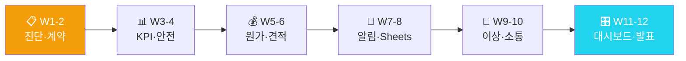

<div align="center">

# 🏗️ 건설·시공 AX 마스터클래스

### "AI로 계약부터 준공까지 설계하는 12주 건설 AX 자동화"

**계약서분석·공정KPI·안전점검 — 현장 데이터로 직접 검증**

[](https://github.com/Reasonofmoon/hexa-5)
[](https://github.com/Reasonofmoon/hexa-5/tree/main/notebooks)
[](https://github.com/Reasonofmoon/hexa-5)
[](https://aistudio.google.com/)
[](LICENSE)

> **"계약서 검토, 공정 보고서 작성, 협력업체 소통... 현장 관리자 하루의 절반이 서류다." 이 과정이 끝나면 자동화됩니다.**

[🚀 W1 바로 시작](https://colab.research.google.com/github/Reasonofmoon/hexa-5/blob/main/notebooks/W01_construction_diagnosis.ipynb) · [📂 전체 노트북](notebooks/) · [🔧 CLI 스크립트](scripts/) · [🐛 이슈](../../issues)

</div>

---

## 🧠 Philosophy — "왜 건설/시공 AX인가"

기존 AI 교육의 문제: **이론만 있고 현장 데이터가 없다**.

| 기준 | 기존 AI 교육 | 건설·시공 AX 마스터클래스 |
|------|-------------|---|
| 데이터 | 가상의 샘플 데이터 | **건설/시공 현장 CSV** |
| 결과물 | 모델 정확도 숫자 | **경영진 보고서 + 자동화 파이프라인** |
| 난이도 | Python 필수 | **Colab 실행만으로 완성** |
| 기간 | 3개월+ 이론 | **W1부터 당일 실전 결과** |
| 연결성 | 개별 실습 | **W1→W12 자동화 파이프라인** |



---

## ⚙️ 12주 커리큘럼

### Layer 1 · Foundation (W1~W4) — AI 기초 도구화

> **Wow**: 공정 계획 대비 실적 분석 → 지연 공정 **자동 감지** + 간트차트

| 주차 | 주제 | 핵심 출력물 | Colab |
|----|------|------------|-------|
| **W1** | 건설 AX 자가진단 | 10항목 레이더 · 건설 AI 전환 로드맵 | [](https://colab.research.google.com/github/Reasonofmoon/hexa-5/blob/main/notebooks/W01_construction_diagnosis.ipynb) |
| **W2** | 계약서 분석 자동화 | 위험조항 추출 · 협상 포인트 리스트 | [](https://colab.research.google.com/github/Reasonofmoon/hexa-5/blob/main/notebooks/W02_construction_contract.ipynb) |
| **W3** | 공정 KPI & 간트차트 | 공정별 진행률 · 지연 감지 · 간트차트 | [](https://colab.research.google.com/github/Reasonofmoon/hexa-5/blob/main/notebooks/W03_construction_kpi.ipynb) |
| **W4** | 안전 점검 자동화 | 30항목 체크리스트 · AI 위험 등급 분류 | [](https://colab.research.google.com/github/Reasonofmoon/hexa-5/blob/main/notebooks/W04_construction_safety.ipynb) |

### Layer 2 · Analytics (W5~W8) — 데이터 기반 의사결정

> **Wow**: 안전 점검 체크리스트 30항목 **2분** 만에 현장 맞춤 생성

| 주차 | 주제 | 핵심 출력물 | Colab |
|----|------|------------|-------|
| **W5** | 원가 분석 & 절감 | 원가 분류 막대 · AI 절감 포인트 3가지 | [](https://colab.research.google.com/github/Reasonofmoon/hexa-5/blob/main/notebooks/W05_construction_cost.ipynb) |
| **W6** | 견적서 자동 생성 | 공종별 견적서 · PDF 다운로드(MD) | [](https://colab.research.google.com/github/Reasonofmoon/hexa-5/blob/main/notebooks/W06_construction_estimate.ipynb) |
| **W7** | 협력업체 알림 | 공정 지연 경보 · 카카오/문자 초안 | [](https://colab.research.google.com/github/Reasonofmoon/hexa-5/blob/main/notebooks/W07_construction_partner_alert.ipynb) |
| **W8** | 공정 Sheets 연동 | 공정현황 Google Sheets · CSV fallback | [](https://colab.research.google.com/github/Reasonofmoon/hexa-5/blob/main/notebooks/W08_construction_process_sheets.ipynb) |

### Layer 3 · Intelligence (W9~W12) — 자동화 운영 시스템

> **Wow**: 협력업체 이슈 발생 시 공문 3종 → **ZIP 다운로드** 즉시

| 주차 | 주제 | 핵심 출력물 | Colab |
|----|------|------------|-------|
| **W9** | 공정 이상 감지 | 진행률 이상 3σ 감지 · 경보메시지 | [](https://colab.research.google.com/github/Reasonofmoon/hexa-5/blob/main/notebooks/W09_construction_progress_anomaly.ipynb) |
| **W10** | 협력업체 소통 | 품질·납기·발주 공문 3종 · ZIP | [](https://colab.research.google.com/github/Reasonofmoon/hexa-5/blob/main/notebooks/W10_construction_vendor_communication.ipynb) |
| **W11** | 건설 종합 대시보드 | 공정·안전·원가 4패널 · AI 인사이트 | [](https://colab.research.google.com/github/Reasonofmoon/hexa-5/blob/main/notebooks/W11_construction_overall_dashboard.ipynb) |
| **W12** | 12주 성과 발표 | 공사 KPI 비교 · 발주처 보고서 자동화 | [](https://colab.research.google.com/github/Reasonofmoon/hexa-5/blob/main/notebooks/W12_construction_12week_result.ipynb) |

---

## 🎯 수준별 활용 가이드

### 🟢 Starter — "5분 안에 첫 AI 결과"
> AX 진단점수 10~24점 · 코딩 경험 없음

1. [W1 노트북](https://colab.research.google.com/github/Reasonofmoon/hexa-5/blob/main/notebooks/W01_construction_diagnosis.ipynb) 클릭 → Google Colab에서 열기
2. `GEMINI_API_KEY` 입력 ([발급](https://aistudio.google.com/apikey))
3. 현장명·공종 입력 → AX 진단 레이더 차트
4. `Ctrl+F9` (전체 실행) → 결과 자동 다운로드

### 🔵 Professional — "실제 데이터로 실전 분석"
> AX 진단점수 25~39점 · 기초 Excel 가능

1. `shared/construction_process_sample.csv` 구조 확인
2. 공정 CSV 업로드 → 간트차트 + 지연 감지 자동화
3. W7~W8에서 Slack/Sheets 연결
4. W9~W10으로 이상감지·소통 자동화 구축

### 🟣 Enterprise — "12주 파이프라인 & 팀 표준화"
> AX 진단점수 40~50점 · 자동화 확장 목표

1. W11 대시보드 → 공정·안전·원가 통합 모니터링
2. W12 보고서를 정기 자동화 스케줄로 전환
3. 다른 hexa 시리즈와 교차 벤치마킹

---

## 🔧 확장 우선순위

| 우선순위 | 커스터마이징 | 난이도 | 영향 범위 |
|----------|--------------|--------|----------|
| **1st** | 현장 정보 입력 | ⭐ | 현장명·공종·발주처 |
| **2nd** | 공정 CSV 실제 데이터 | ⭐⭐ | 분석 전체 |
| **3rd** | 협력업체 알림 연결 | ⭐⭐ | 실시간 경보 |
| **4th** | Sheets 공정 대시보드 | ⭐⭐⭐ | 발주처 공유 |
| **5th** | W12 준공 보고 자동화 | ⭐⭐⭐ | 발주처·감리 자동 리포트 |

---

## 📂 프로젝트 구조

```
hexa-5/
├── notebooks/          ← 12주 Colab 실습 노트북 (W01~W12)
│   ├── W01_construction_diagnosis.ipynb              # W1: 건설 AX 자가진단
│   ├── W02_construction_contract.ipynb               # W2: 계약서 분석 자동화
│   ├── W03_construction_kpi.ipynb                    # W3: 공정 KPI & 간트차트
│   ├── W04_construction_safety.ipynb                 # W4: 안전 점검 자동화
│   ├── W05_construction_cost.ipynb                   # W5: 원가 분석 & 절감
│   ├── W06_construction_estimate.ipynb               # W6: 견적서 자동 생성
│   ├── W07_construction_partner_alert.ipynb          # W7: 협력업체 알림
│   ├── W08_construction_process_sheets.ipynb         # W8: 공정 Sheets 연동
│   ├── W09_construction_progress_anomaly.ipynb       # W9: 공정 이상 감지
│   ├── W10_construction_vendor_communication.ipynb   # W10: 협력업체 소통
│   ├── W11_construction_overall_dashboard.ipynb      # W11: 건설 종합 대시보드
│   ├── W12_construction_12week_result.ipynb          # W12: 12주 성과 발표
├── scripts/            ← CLI Python 스크립트 (공정KPI · 견적자동화 · 알림발송)
├── shared/             ← 실습 데이터 (construction_process_sample.csv)
└── labs/               ← 보조 실습 가이드
```

---

## 🚀 빠른 시작

```bash
git clone https://github.com/Reasonofmoon/hexa-5.git && cd hexa-5
pip install google-generativeai pandas matplotlib numpy  # 로컬 실행 시
```

[](https://colab.research.google.com/github/Reasonofmoon/hexa-5/blob/main/notebooks/W01_construction_diagnosis.ipynb)
[](https://colab.research.google.com/github/Reasonofmoon/hexa-5/blob/main/notebooks/W02_construction_contract.ipynb)
[](https://colab.research.google.com/github/Reasonofmoon/hexa-5/blob/main/notebooks/W03_construction_kpi.ipynb)
[](https://colab.research.google.com/github/Reasonofmoon/hexa-5/blob/main/notebooks/W04_construction_safety.ipynb)

---

## 🔗 전체 AX 시리즈 (hexa-1~6)

| 레포 | 섹터 | 핵심 AI 자동화 | 링크 |
|------|------|--------------|------|
| **hexa-1** | 🏭 제조업 | 불량분류·OEE·예지보전 | [→](https://github.com/Reasonofmoon/hexa-1) |
| **hexa-2** | 🍽️ F&B | 리뷰분석·메뉴카피·재고예측 | [→](https://github.com/Reasonofmoon/hexa-2) |
| **hexa-3** | 🛒 소매/이커머스 | 상품카피·CRM·SEO분석 | [→](https://github.com/Reasonofmoon/hexa-3) |
| **hexa-4** | 📚 교육/학원 | 교안자동화·성적분석·챗봇 | [→](https://github.com/Reasonofmoon/hexa-4) |
| **hexa-5** (현재) | 🏗️ 건설/시공 | 계약서·공정KPI·안전점검 | — |
| **hexa-6** | 💼 IT서비스 | 제안서·코드리뷰·인시던트 | [→](https://github.com/Reasonofmoon/hexa-6) |

---

## 🌐 다국어 지원

| 항목 | 현황 |
|------|------|
| 노트북 UI | 🇰🇷 한국어 |
| 스크립트 출력 | 한국어 (컬럼 한/영 자동감지) |
| 샘플 데이터 | 한국어 컬럼명 |
| README | 한국어 / English (예정) |

---

*AX Consulting Curriculum © 2026 | Powered by Google Gemini 2.0 Flash*
